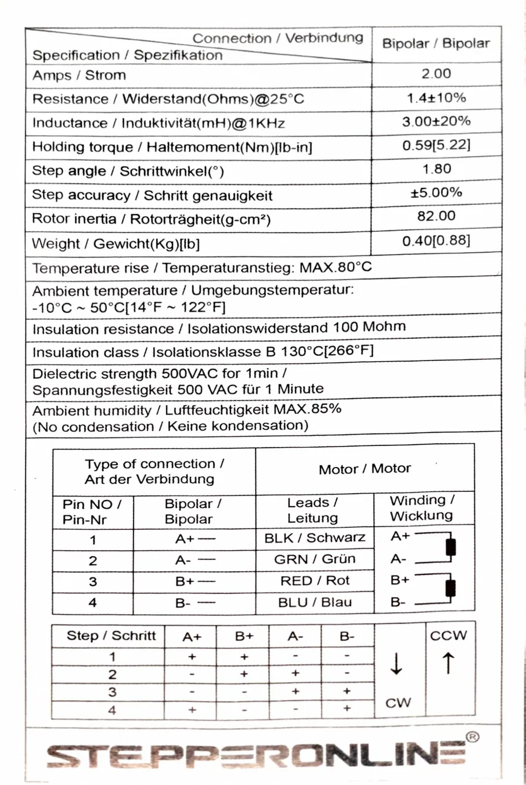
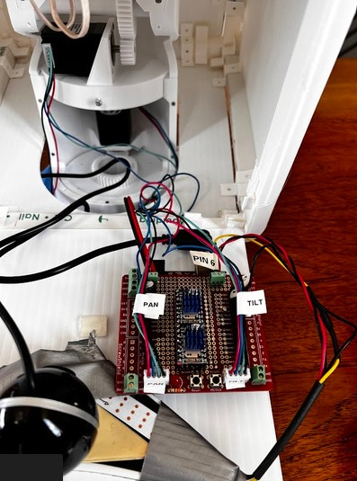
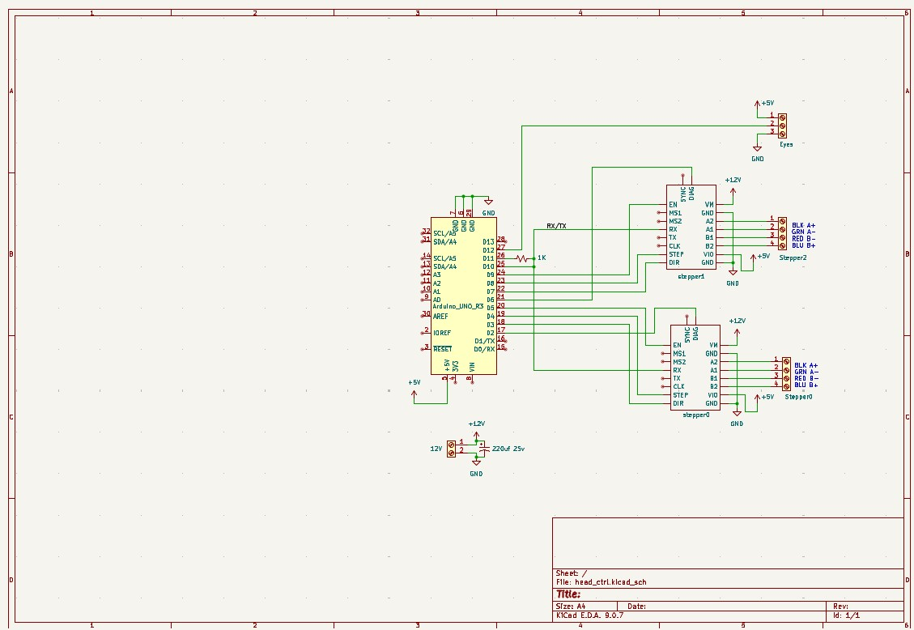
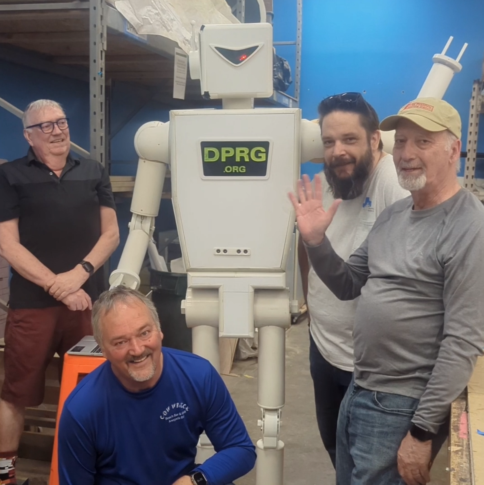
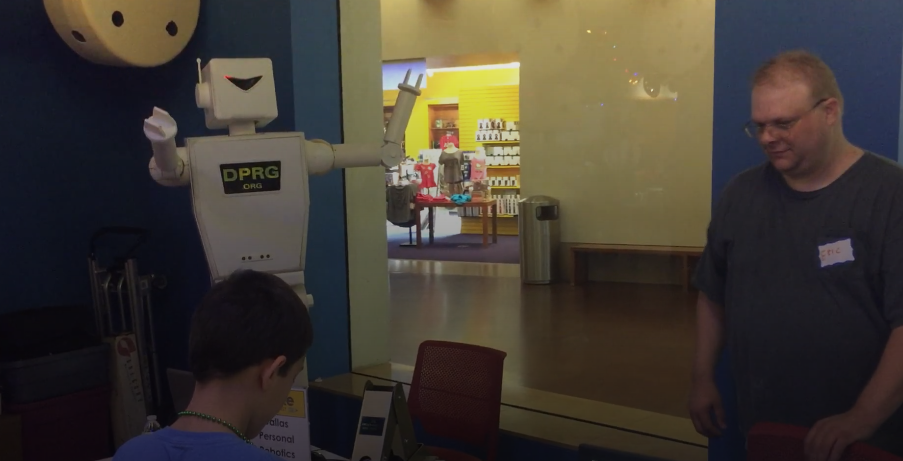
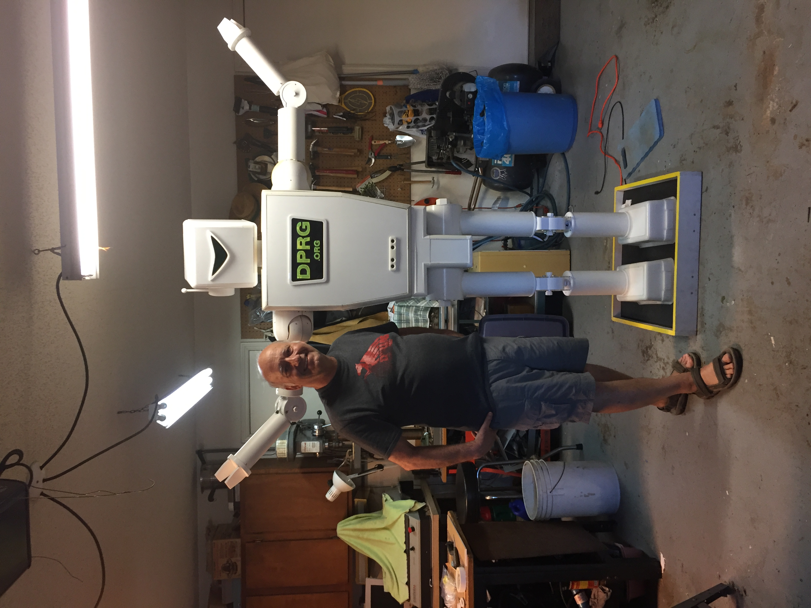

# Robie-Big-Robot
Files related to Robie, the 7-foot tall DPRG mascot.

# Repo Contents

CAD models are in mechanical/cad_files. At the time of repo creation they contained 
the design files delivered by Ron Grant to Paul Bouchier on 26 Feb 2025.

Arduino files are as delivered by Doug Paradis to Paul Bouchier on March 2 2025. 
Mike Williamson added the Robie_neck_eyes code for the head UNO 7/7/2026.

Raspberry Pi4 files TBD
=======

There are two Arduino source code directories: Big_robot_pgm1 and Robie_neck_eyes.

1. Big_robot_pgm1 contains arduino code for the body and arm motors, which are controlled by
the arduino mega in the torso.
2. Robie_neck_eyes contains arduino code for the head motors and eye LEDs.

# Raspberry Pi Head Tracking

1. Connect to Robie's AP: robiewifi, wifi passwd is inside the body
2. You will get an IP at: 10.42.0.x
3. ssh into the RPi: ssh robie@10.42.0.1 # passwd is inside the body
4. Use aliases miniterm_head and miniterm_body to connect to the arduinos and manually issue commands. Ctrl-] to exit
5. Connect a NoMachine client to robie desktop as above
6. launch a terminal session on the desktop
7. In the terminal session:
- cd Robie-Big-Robot/src
- source venv/bin/activate
- python face_detector.py

# Motors

### New Head Pan Motor

A stepper motor to pan the head is now located in the neck of Robie instead of in the torso.

It uses a BigTreeTech TMC2209 stepper controller module controlled my the head UNO.
The head movement limit is now detected by current sensing stall technology in the 2209.

The head motor is a NEMA 11 motor from stepperonline.com, P/N 11HS20-0674S.
Specs [here](https://www.omc-stepperonline.com/nema-11-bipolar-1-8deg-12ncm-17oz-in-0-67a-6-2v-28x28x51mm-4-wires-11hs20-0674s)

There are still 20 command steps for full range using 'L' and 'R' char commands.
There is also a new head center 'C' command.

### New Head Tilt Motor

The head tilt motor is a NEMA 17 motor from stepperonline.com, P/N 17HS19-2004S1.

#### Specs


A stepper motor to tilt the head is now located in the neck of Robie instead of in the torso.

It uses a BigTreeTech TMC2209 stepper controller module controlled my the head UNO.
The head movement limit is now detected by current sensing stall technology in the 2209.
Wiki [here](https://global.bttwiki.com/TMC2209.html)

There are 10 command steps for full range using 'U' and 'D' char commands.
There is also a new head center 'C' command.

# System Architecture

Robie is controlled by a Raspberry Pi 4 which sends motion commands to two arduinos:

1. Body Arduino: controls motors in arms
2. Head Arduino: controls head

The Raspberry Pi has a USB camera feed from the eye area, and uses it to recognize faces
and move the head to command the Head Arduino to move the head to track the biggest
(presumably nearest) face in the frame.

The raspberry pi built-in wifi interface is used to connect to wifi networks (e.g. DMS-member).
The raspberry pi has an add-in USB wifi dongle that offers an AP. Login details for the
AP and the Raspberry Pi are on the Robie's back door.

## Shoulder rotate and lift motors

The right shoulder rotate and lift motors are DC motors, with HW limit switches
that interrupt motor power when a limit is hit. The limit state is not
available to FW, but the current position is sensed by a potentiometer
and is available to FW.  The rotate motor rotates the right arm about
the shoulder in the forward direction, and the lift motor lifts the
right arm sideways.  The range of motion available between limits is
180 degrees for both rotate and lift. The lift sensing pot reads 100 -
770 in the ADC at each extreme.  The rotate sensing pot reads 230 -
950 in the ADC at each extreme.  When commanded to take a step move,
the motor is run for 40ms with a PWM speed of 125.  This motor has a
"move to position" function in FW, wherein the FW drives the motor until
the potentiometer achieves a requested feedback value. Note that the
weight of the arm means the arm travels downward further than upward
for a single move request.

## Left wave motor

The left wave motor twists the hand on the forearm. It is a regular servo
with 360 degrees (approx) range of motion, and it moves to the position
requested by the applied PWM.

## Right wave motor

The right wave motor twists the hand on the forearm. It is a continuous-rotation servo
and is stationary for mid-range applied PWM, and rotates continuously at different speeds
based on how far the applied PWM is from mid-range.

# Arduino API

The commands available from the arduino are listed here. They are received on the serial
ports, and can come from a human on a comms terminal or a program driving serial commands.

---

### Legacy Commands

These commands are the API as of early 2025. Commands are single letters and
are executed immediately upon receipt (no CR-LF required). Multiple commands
are buffered and executed in order.

- L - Pan head left. Responds with L
- R - Pan head right. Responds with R
- U - Tilt head up. Responds with U
- D - Tilt head down. Responds with D.
- W - Rotates left wrist twice in each direction. Responds with W.
- E - Rotates right wrist twice in each direction. Responds with E.
- 1 - Lift the arm sideways (up/away from body). Responds with:<br>
lift_feedback, rotate_feedback<br>
1<br>
- 2 - Rotate the arm CCW on the shoulder. If the arm is hanging down this results
in forward and up)motion. Similar response as 1 except echoes 2
- 3 - The opposite of 1. Similar response as 1 except echoes 3
- 4 - The opposite of 2. Similar response as 1 except echoes 4
- 5, 6, 6, 7 - Move to fixed poses. Responds with a series of (lift_feedback, rotate_feedback)
pairs until movement is complete.

The LRUD commands are now processed in the UNO in its head.
A new C (Center) command centers the head to look slightly down and straight ahead.

## Electronics, power distribution and wiring

### Raspberry Pi4
There is a Pi4 in the torso that processes the images from the head camera and send commands to the Torso MEGA and Head UNO over USB serial cables. 

### Torso Arduino MEGA controller
The MEGA controls the arms and wrist movements.
The head movement are now controlled by the UNO in its head.

### Head Arduino UNO controller

The UNU now has a DIY shield for the TMC2209 stepper motor modules 
and eyes and 12V connections.



# Raspberry Pi SW install instructions

## Install Raspberry Pi OS

- Use rpi-imager to create a bootable SD card with Raspberry Pi OS (Bookworm). Bookworm
is important because, as of July 2026, the mediapipe face recognizer software doesn't
run on the Trixie release. Set the environment to connecto to your local wifi, and create
user account "robie" with a suitable password
- Connect a physical keyboard/mouse/monitor and boot the RPi
- Start the ssh service (it is pre-installed with Raspberry Pi OS):
```bash
sudo systemctl enable ssh
sudo systemctl start ssh
```
- Log into the RPi from a laptop to verify everything is working

## Add USB wifi dongle as access point

Note: you need to be very selective - only a few wifi dongles support modern Linux and Raspberry Pi OS

```bash
sudo nmcli connection add type wifi con-name "USB_Hotspot" ifname wlan1 ssid "robiewifi" mode ap ipv4.method shared
sudo nmcli connection modify "USB_Hotspot" wifi-sec.key-mgmt wpa-psk wifi-sec.psk "YourSecurePassword"
sudo nmcli connection up "USB_Hotspot"
```

## Install mediapipe and opencv
You need to set up a virtual environment to install these python packages without compromising
the python system.

```bash
# 1. Install core system prerequisites
sudo apt update && sudo apt install -y python3-venv python3-pip

# 2. Create and activate a clean environment
cd Robie-Big-Robot/src
python -m venv venv
source venv/bin/activate

# 3. Upgrade your package installers inside the environment
pip install --upgrade pip setuptools wheel

# 4. Attempt the installation
pip install pyserial
pip install "opencv-contrib-python<5.0"
pip install mediapipe=0.10.14
```

# Arduino Install Instructions

Arduino 1.8 is installed on the Raspberry Pi, so you can edit arduino code directly on the
RPi desktop and program the arduino from the RPi without disconnecting anytthing.

When installing this repo to build arduino code on a new machine you'll need to install three
libraries for the head project:

- TMCStepper
- MultiStepperLite
- Adafruit_NeoPixel

# Robie's Want List

Things Robie could really use:

## Mechanical upgrades & fixes desired

- The green visor makes webcam vision difficult. It darkens the scene, and cameras that don't
have automatic white balance will fail because the whole scene looks green, which upsets the
face detection. The desire is to have a wider angle camera with an untinted view of the scene.
How to do this?

## Electrical upgrades & fixes desired

- The connectors for the right shoulder pots should be on keyed wiremount
connectors that don't fall apart all the time
- The flying lead going to D35 which drives the right wrist needs to
get wired to a terminal block, and thence to a 3-wire (at least) unique
connector going up into the arm, replacing the XT30 that currently
supplies power to the right wrist.
- An elbow (with a BLDC motor) would give it much more expressiveness.

### Software upgrades & fixes desired

- Provide a parser better suited to computer control. The current
parser is good for human interaction, but has weaknesses for
API interaction (irregular feedback) and is not suited to async operation.
It would be desirable for it to use a different serial port, and be a
whole different parser that uses json to pass commands & status, so
as to retain the debug output and human-interactive aspects of the
current parser on the arduino serial port.

## Media

Robie Resuscitation 2025

<br>
Robie at iMake Ft Worth (2017)

<br>
Robie with Doug

<br>
### Videos
[Video: Resuscitated Robie moving](https://youtu.be/EISYc3Z7FQA)
<br>
[Video: Early Robie at a DPRG show](https://youtu.be/n2Y_eyLx5xM)

## Changelog

Mike Williamson 3/21/2025<br>
Added opencv code to detect faces which will control the head to point to it and maybe even wave when centered on face<br>

start code: cd to opencv in terminal run py -f facedet_test.py<br>

Mark R 3/26/2025
Added support for Linux, as well as some error catching stuff

<br>
It is based on the instructions from this page:
https://thepythoncode.com/article/detect-faces-opencv-python 
<br>
Paul B 4/1/2025
Removed duplicate arduino directory Big_robot_pgm2. Added image to README.md
<br>
Mikew 7/7/2026<br>
Added code for the UNO in Robie's head. It now controlls the pan and tilt steppers as well as the eyes
